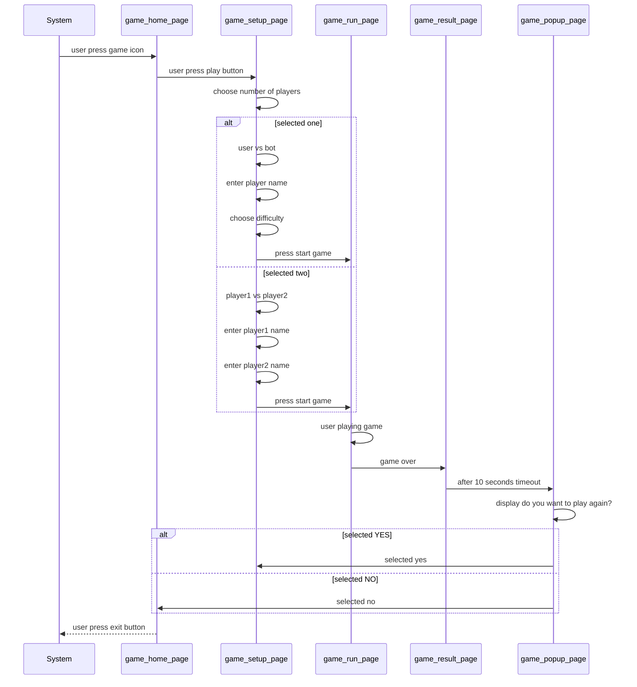

# Interaction Sequences

## Startup Sequence

_Diagram not visible? Use the
[Mermaid live viewer](https://mermaid-js.github.io/mermaid-live-editor)

## Movement Initiation

-describe-how-modules-interact-to-make-the-ball-move

## One score

-describe-how-the-modules-interact-to-record-scores
