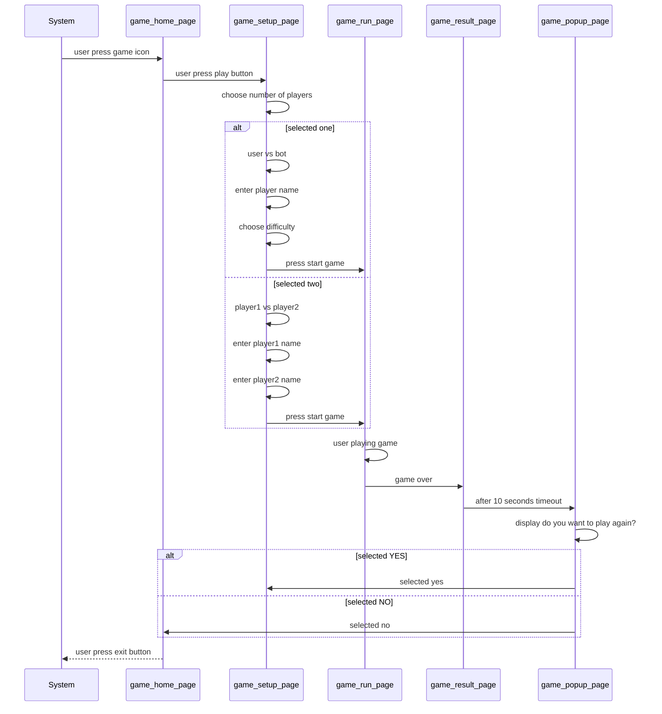
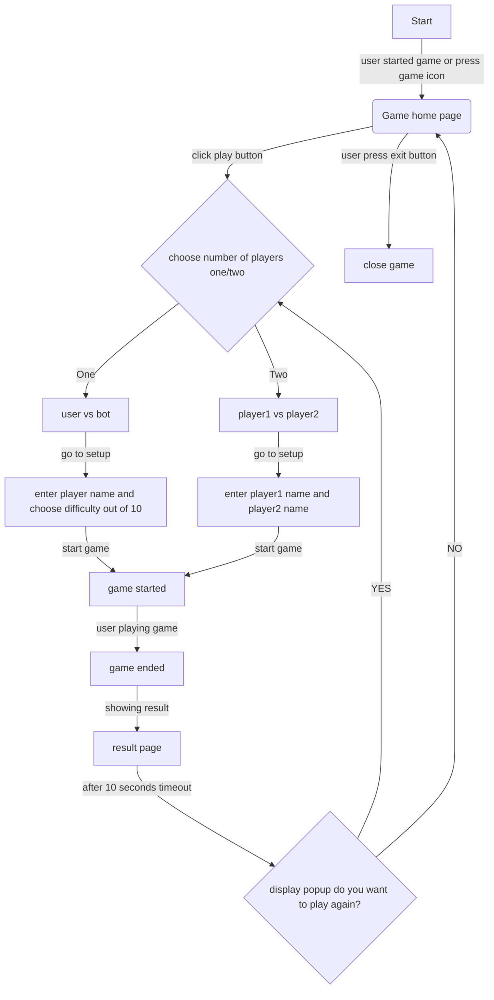

# The taste of success

Your game is trending! The installations are encouraging!

## In app purchase

option is in home page module

## Startup Sequence

_Diagram not visible? Use the
[Mermaid live viewer](https://mermaid-js.github.io/mermaid-live-editor)
or use a [VScode plug-in](https://marketplace.visualstudio.com/items?itemName=bierner.markdown-mermaid)_

## Activity flow

_Diagram not visible? Use the
[Mermaid live viewer](https://mermaid-js.github.io/mermaid-live-editor)
or use a [VScode plug-in](https://marketplace.visualstudio.com/items?itemName=bierner.markdown-mermaid)_
