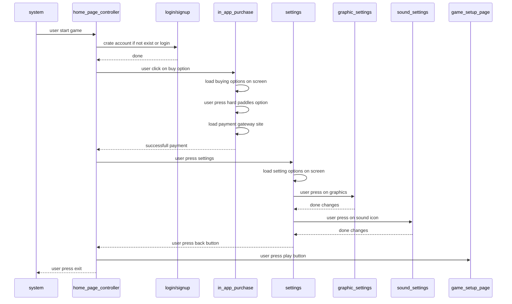

# Feature

Display home page and controls feature on home page

## Sequence Flow

_Diagram not visible? Use the
[Mermaid live viewer](https://mermaid-js.github.io/mermaid-live-editor)
or use a [VScode plug-in](https://marketplace.visualstudio.com/items?itemName=bierner.markdown-mermaid)_

## Acceptance Criteria

### Scenario: user press play button

  Given home page is active and game is working

  When user press play button

  Then module gives control to game_setup_page module
  
### Scenario: user press exit button

  Given home page is active and game is working

  When user press exit button

  Then module gives control to system module
  