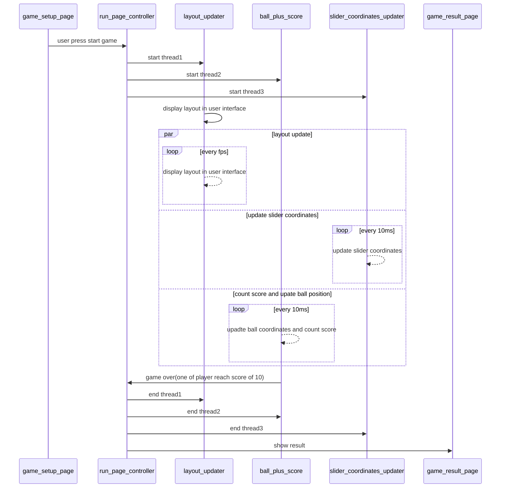

# Feature

Controls movement of ball and slider according to user input
Counts result or score of gameplay

## Sequence Flow

_Diagram not visible? Use the
[Mermaid live viewer](https://mermaid-js.github.io/mermaid-live-editor)
or use a [VScode plug-in](https://marketplace.visualstudio.com/items?itemName=bierner.markdown-mermaid)_

## Acceptance Criteria

### Scenario: Game is completed or game is over

  Given game run page is active and game is working

  When Game is completed

  Then module gives control to game_result_page module